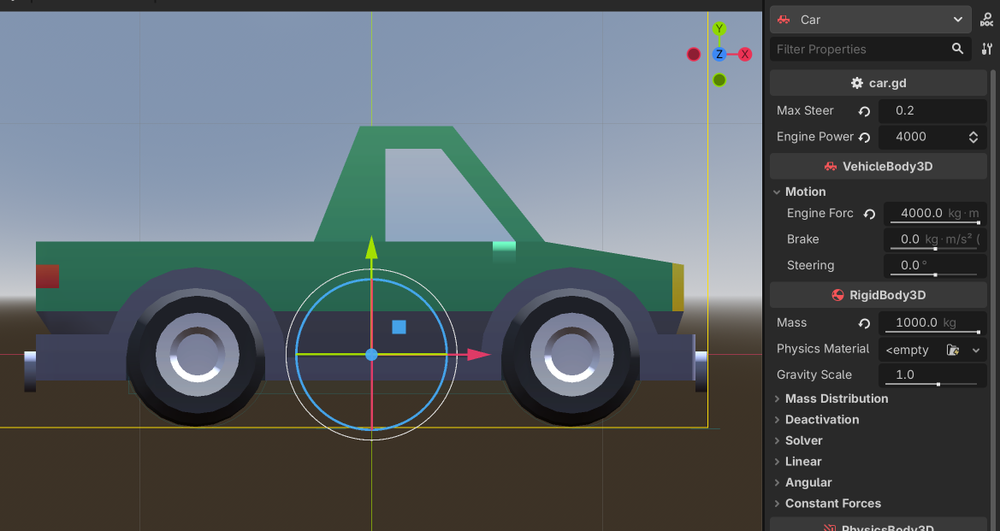
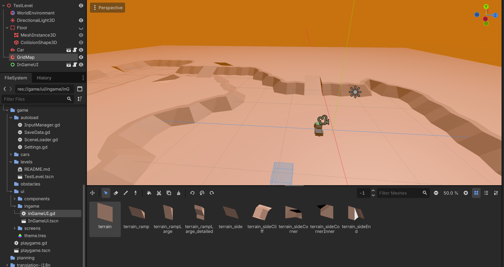

## Overview

Oil Driver is a 3D isometric driving adventure where Saad has to deliver oil for his overlord Conald Trumc through Saudi Arabia because the street of Hormuz is closed.

## Working with this Project:
**Before implementing a new feature create a new branch!** Name them `feature/your-feature-name`.

```bash
git branch feature/your-feature-name
```


    oil-driver/
    ├── project.godot
    ├── README.md
    ├── .gitignore
    ├── assets/                 <- ART
    │   ├── Models/
    │   ├── Textures/
    │   └── Environments/
    ├── audio/
    │   ├── music/
    │   └── soundfx/
    ├── game/                   
    │   ├── autoload/
    │   ├── cars/               
    │   │   ├── car.tscn        <- CAR CHARACTER
    │   │   └── car.gd
    │   ├── levels/
    │   │   └── Level.tscn      <- LEVEL/WORLD
    │   ├── obstacles/
    │   └── ui/
    ├── planning/
    └── translation/
 
### Car 
Can be edited with godot and tweaked under properties:

### Level
Detailed instruction will follow soon sorry.
Basically 
1. copy level
2. edit level using GridMap



## Current Tasks

- [X] **Reset Button** - Add in-game reset functionality
- [ ] **Testing Toggles** - Developer testing options in settings
    - [ ] Auto acceleration
    - [ ] Input acceleration
- [ ] **Freeflow Camera** - Implement dynamic camera system
- [ ] **Repo Explanation** - Create image explanation
- [ ] **Add Licenses** - HDM Licenses Button

## Stack

The project utilizes a variety of specialized development and management tools:

    Engine: Godot.
    Art & Modeling: Blender, Crocotile3d, Picocad, and Canva.
    Management & Version Control: Jira, Git, Google Workspace, and lettucemeet.
    Communication: Discord and WhatsApp.

## Team

The project is being developed by Team 3, consisting of the following members:

    Producer: Asjad 
    Game Designer: Sunny 
    Programmer: Jakob 
    Artist: Alicja
